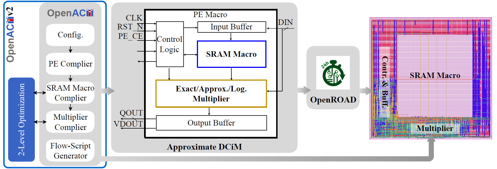
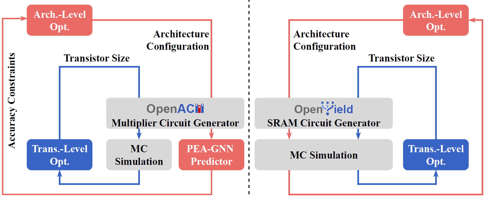

# **OpenACMv2: Accuracy-Constrained Co-Optimization for Approximate DCiM**


This repository contains the implementation of:

**OpenACMv2: An Accuracy-Constrained Co-Optimization Framework for Approximate DCiM**

OpenACMv2 extends the original OpenACM compiler and integrates ideas from OpenYield to support

accuracy-constrained two-level optimization for approximate Digital Compute-in-Memory (DCiM):

1. **Level-I (Architecture-Level Optimization)**
    
    Accuracy-constrained exploration of compressor assignments, approximate PP-column patterns,
    
    and SRAM macro configurations, supported by the PEA-GNN surrogate predictor.
    
2. **Level-II (Transistor-Level Optimization)**
    
    PVT/variation-aware transistor sizing for approximate compressors and SRAM bit-cells
    
    using SPICE Monte Carlo simulation.
    

At this stage, the repository mainly contains the circuit-generation front-end

(multiplier/SRAM/PE generators, RTL templates, and OpenROAD flow scripts).

Two-level ACCO modules will be released incrementally under `examples/` and documented in `docs/`.

---

## 🔍 Overview

Digital Compute-in-Memory (DCiM) improves efficiency by performing arithmetic close to SRAM arrays.

Approximate DCiM leverages neural networks’ error tolerance to further optimize power, area, and energy.

However, approximate DCiM requires navigating a coupled design space involving:

- Approximate 4–2 compressor choices
- Column-wise approximation patterns
- SRAM macro and bank configuration
- Transistor sizing under PVT conditions
- System-level accuracy constraints (MRED, NMED)

OpenACMv2 introduces **Accuracy-Constrained Co-Optimization (ACCO)** to jointly address these challenges.

---

## ✨ Highlights

### ✔️ Open-Source DCiM Front-End

- Exact / approximate / logarithmic multipliers
- Parameterized SRAM macros
- DCiM PE generation (SRAM + multiplier + control logic)
- Full OpenROAD-compatible backend flow

### ✔️ Two-Level Optimization (ACCO)

- **Level-I:** Architecture search under accuracy constraints
- **Level-II:** Device-level sizing with PVT and variation robustness
- Produces Pareto-optimal designs satisfying user accuracy budgets

### ✔️ GNN Surrogate (PEA-GNN)

- Encodes compressor assignments as hierarchical graphs
- Jointly predicts MRED, NMED, delay, area, and power
- Enables large-scale architecture exploration

### ✔️ Reproducible and Extensible

- Based on FreePDK45 + OpenROAD
- Supports custom approximate compressors
- Modular design for future algorithmic extensions

---

## 📁 Repository Structure
```
OpenACM/
├── docs/ Documentation, notes, figures
├── examples/ Example flows 
├── openacm/
│ ├── flow_script_generator/Generates OpenROAD backend flow scripts
│ ├── sram_compiler/ SRAM circuit generation and SPICE evaluation
│ ├── pe_compiler/Integrates multiplier + SRAM into DCiM PE
│ ├── multiplier_compiler/ Generates exact and approximate multipliers
│ ├── multiplier_gnn/ GNN surrogate models (PEA-GNN)
│ ├── compressor_sizing/ Transistor-level optimization of 8 compressors (SPICE + lib gen)
│ └── optimization_algorithm/ Implementations of supported optimization algorithms
├── DCIM/ ASIC DCiM full backend workflow (OpenROAD)

├── DCIM_OPT/ Two-level optimization workspace
├── LICENSE
└── README.md
```
---

## ⚙️ Installation

Clone the repository:

```
git clone https://github.com/ShenShan123/OpenACM.git
cd OpenACM
```

Python environment:

```
conda create -n pytorch python=3.10
conda activate pytorch
pip install torch==2.8.0+cu128 torchvision==0.23.0+cu128 \
--index-url https://download.pytorch.org/whl/cu128
pip install -r requirements.txt --no-deps
```

Required external tools:

- OpenROAD
- OpenSTA
- FreePDK45
- OpenYield
- Xyce Parallel Electronic Simulator

---

## 🚀 Quick Start (Basic DCiM Flow)

### 1. Generate Flow Scripts

`flow_script_generator.py` configures the **SRAM macro placement** and produces the backend scripts used by OpenROAD.

```
python openacm/flow_script_generator/flow_script_generator.py \
    --design_name dcim_pe \
    --top_model top_pe \
    --location_x 30 \
    --location_y 15 
```

The generated multiplier files are stored in `DCIM/tcl/`

### 2. Generate SRAM Macro

`SRAM.py` creates a **behavioral 6T SRAM model** with user-specified bit-width and depth.

```
python openacm/pe_compiler/SRAM.py \
    --data_width 8 \
    --addr_count 16 \
    --rtl_dir ./rtl 
```

The generated multiplier files are stored in `DCIM/rtl/`

### 3. Generate Multiplier and PE

Multiplier:

This step produces an exact or approximate multiplier depending on the configuration.

```
python openacm/multiplier_compiler/multiplier_compiler.py --bit_width 8
```

The generated multiplier files are stored in `DCIM/multiplier/`

PE:

`pe_compiler.py` configures the **PE architecture**, including SRAM interface logic, dataflow control, and multiplier integration.

```
python openacm/pe_compiler/pe_compiler.py \
    --data_width 8 \
    --addr_count 16 \
    --multiplier_module Exact 
```

The generated multiplier files are stored in `DCIM/rtl/`

### 4. Run Backend Flow

Once RTL and script generation is complete, run the physical design flow:

```
./DCIM/tcl/eda.sh
```

This invokes synthesis, floorplanning, placement, routing, timing, and power analysis to produce a **physically implemented DCiM macro**.

---

## 📐 OpenACM Circuit Generation Flow



OpenACM provides a fully automated pipeline that transforms **architecture-level specifications** into a **physically implemented DCiM macro**, enabling end-to-end generation without relying on proprietary SRAM or macro compilers. Starting from the user-defined PE architecture and multiplier configuration, OpenACM progressively constructs the PE logic, approximate/exact multipliers, scalable SRAM arrays, and finally completes a full OpenROAD backend flow.

The compilation flow includes four major components:

- **PE Compiler** – Generates the control logic for SRAM and multipliers, along with input/output buffering. The PE autonomously initializes the SRAM, performs data–SRAM multiplication, and outputs the final results.
- **Multiplier Compiler** – Supports exact multipliers of arbitrary bit widths, precision-configurable approximate multipliers based on customizable 4–2 compressor trees, and logarithmic multipliers for ultra-efficient large-bit-width designs.
- **SRAM Macro Compiler** – Constructs 6T SRAM arrays of any size and produces the associated read/write and peripheral circuitry.
- **Flow-Script Generator** – Produces backend scripts for OpenROAD, performing synthesis, place-and-route, and sign-off analysis to deliver a tape-out–ready DCiM macro.

Through this unified automation flow, OpenACM enables fast design exploration under different accuracy, power, and area constraints, providing a practical open-source solution for accuracy-aware DCiM co-optimization.

---

## 🎯 Two-Level Optimization in OpenACMv2 (ACCO Framework)

### Level-I Optimization (Architecture-Level)

Explores:

- Compressor assignments across multiplier columns
- Approximate vs. exact PP-column patterns
- SRAM macro structure

Under constraints such as MRED and NMED.

Includes:

- PEA-GNN surrogate
- Multi-objective optimizers (NSGA-II, MOEA/D, SMAC, MOBO)
- Accuracy-feasible architecture search

Scripts will be added in:

```
DCIM_OPT/tcl/level1_opt.py/ Level-I architecture optimization for multiplier/SRAM    
openacm/optimization_algorithm/ Supported optimizers (MOEA/D, NSGA-II, SMAC, MOBO, etc.)
```

---

## 🔧 Level-II Optimization (Transistor-Level)

Performs:

- Transistor sizing considering PVT variation
- SPICE Monte Carlo simulation
- Correctness validation and PPA evaluation
- Accuracy-constrained sizing search

Will be available in:

```
DCIM_OPT/tcl/level2_opt.py/ Level-II sizing optimization for multiplier/SRAM 
openacm/optimization_algorithm/ Supported optimizers (MOEA/D, NSGA-II, SMAC, MOBO, etc.)
```
---

## 🧩 ACCO Framework Diagram



After the two-level ACCO optimization completes, the selected multiplier and SRAM designs
together with their generated RTL and Liberty (.lib) files are automatically exported to the
corresponding directories under `DCIM/`. These optimized components are then used as inputs to
the OpenROAD-based backend flow for final ASIC implementation.
---

## 🔢 Supported Approximate Compressors

The multiplier front-end supports:

- Yang1 (AP1)
- Kong2
- Antonio
- Momeni
- Ha
- Akbar1
- Akbar2
- SabetZ

New compressors can be added through `nbit_approx.py`.


---

## 📄 Citation

[1] Z. Yang, J. Han, and F. Lombardi, “Approximate compressors for error-resilient multiplier design,” 2015 IEEE International Symposium on Defect and Fault Tolerance in VLSI and Nanotechnology Systems (DFTS), Amherst, MA, USA, 2015, pp. 183-186.

[2] T. Kong and S. Li, “Design and Analysis of Approximate 4–2 Compressors for High-Accuracy Multipliers,” in IEEE Transactions on Very Large Scale Integration (VLSI), Systems, vol. 29, no. 10, pp. 1771–1781, Oct. 2021.

[3] A. G. M. Strollo, E. Napoli, D. De Caro, N. Petra, and G. D. Meo, “Comparison and Extension of Approximate 4-2 Compressors for Low-Power Approximate Multipliers,” IEEE Trans. Circuits Syst. I Regul. Pap., vol. 67, no. 9, pp. 3021–3034, Sep. 2020.

[4] A. Momeni, J. Han, P. Montuschi, and F. Lombardi, “Design and Analysis of Approximate Compressors for Multiplication,” IEEE Trans. Comput., vol. 64, no. 4, pp. 984–994, Apr. 2015.

[5] M. Ha and S. Lee, “Multipliers With Approximate 4–2 Compressors and Error Recovery Modules,” IEEE Embed. Syst. Lett., vol. 10, no. 1, pp. 6–9, Mar. 2018.[6] O. Akbari, M. Kamal, A. Afzali-Kusha, and M. Pedram, “Dual-Quality 4:2 Compressors for Utilizing in Dynamic Accuracy Configurable Multipliers,” in IEEE Transactions on Very Large Scale Integration (VLSI), Systems, vol. 25, no. 4, pp. 1352–1361, Apr. 2017.

[6] O. Akbari, M. Kamal, A. Afzali-Kusha, and M. Pedram, “Dual-Quality 4:2 Compressors for Utilizing in Dynamic Accuracy Configurable Multipliers,” in IEEE Transactions on Very Large Scale Integration (VLSI), Systems, vol. 25, no. 4, pp. 1352–1361, Apr. 2017.

[7] F. Sabetzadeh, M. H. Moaiyeri, and M. Ahmadinejad, “A Majority-Based Imprecise Multiplier for Ultra-Efficient Approximate Image Multiplication,” IEEE Trans. Circuits Syst. I Regul. Pap., vol. 66, no. 11, pp. 4200–4208, Nov. 2019.

## 📜 License

This project is licensed under Apache-2.0.

---

## 🙏 Acknowledgements

OpenACMv2 builds on:

- OpenACM (approximate CiM compiler)
- OpenYield (variation-aware optimization)
- OpenROAD + FreePDK45
