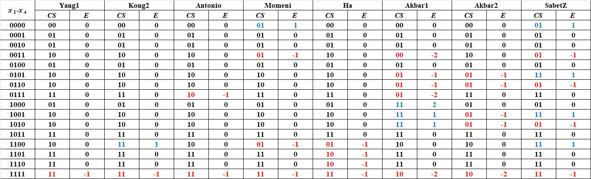

# OpenACMv2

The initial version of paper" OpenACMv2: An Accuracy-Constrained Co-Optimization Framework for Approximate DCiM"

\##Arguments##

python flow\_script\_generator.py \[options]

--design\_name			Name of the design

--top\_model			Top-level model name

--platform			Target platform name

--platform\_dir			Directory containing platform files

--lib					Path to standard cell library file

--lib\_typical			Path to typical cell library file

--v					Path to Verilog library file

--tech\_lef				Path to technology LEF file

--sc\_lef				Path to standard cell LEF file

--sram\_lef			Path to SRAM LEF file

--sram\_lib			Path to SRAM library file

--rcx\_rules			Path to RCX rules file

--sdc\_file				Path to SDC constraints file

--scripts\_dir			Directory containing scripts files

--reports\_dir			Directory for reports

--location\_x			X-coordinate for SRAM macro placement

--location\_y			Y-coordinate for SRAM macro placement

--result\_dir			Directory for output results

--rtl\_dir				Directory containing RTL files

--multiplier\_dir			Directory containing multiplier files

python SRAM.py \[options]

--data\_width			Width of the data bus (in bits)

--addr\_count			Number of addressable locations (depth)

--rtl\_dir				Directory containing RTL files

--result\_dir			Directory for output results

python pe\_compiler.py \[options]

--data\_width			Width of the data bus (in bits)

--addr\_count			Number of addressable locations (depth)

--multiplier\_module		Name of the multiplier

--rtl\_dir				Directory containing RTL files

multiplier\_compiler.py  \[options]

--bit\_width			      Width of the multiplier

--generate\_Exact()           Generates exact multipliers

--generate\_Appro\_4\_2()  Generates approximate 4-2 compressor-based multipliers

--generate\_Log()             Generates log-based multipliers

Note:

We have updated the function generate\_Appro\_4\_2(test\_bit\_widths) to enhance the flexibility of the multiplier compiler. This update enables the program to automatically calculate the required number of approximate 4-2 compressors for a given bit width. The function supports batch generation for multiple bit widths and provides an interactive interface that allows users to choose combinations from eight predefined classic approximate compressors: Yang1[1], kong2[2], antonio[3], momeni[4], ha[5], akbar1[6], akbar2[6], and sabetz[7]. If no input is provided, the system will default to Yang1.

\### Truth Table of Approximate 4-2 Compressors

[1] Z. Yang, J. Han, and F. Lombardi, “Approximate compressors for error-resilient multiplier design,” 2015 IEEE International Symposium on Defect and Fault Tolerance in VLSI and Nanotechnology Systems (DFTS), Amherst, MA, USA, 2015, pp. 183-186.  
[2]	T. Kong and S. Li, “Design and Analysis of Approximate 4–2 Compressors for High-Accuracy Multipliers,” in IEEE Transactions on Very Large Scale Integration (VLSI), Systems, vol. 29, no. 10, pp. 1771–1781, Oct. 2021.  
[3]	A. G. M. Strollo, E. Napoli, D. De Caro, N. Petra, and G. D. Meo, “Comparison and Extension of Approximate 4-2 Compressors for Low-Power Approximate Multipliers,” IEEE Trans. Circuits Syst. I Regul. Pap., vol. 67, no. 9, pp. 3021–3034, Sep. 2020.  
[4]	A. Momeni, J. Han, P. Montuschi, and F. Lombardi, “Design and Analysis of Approximate Compressors for Multiplication,” IEEE Trans. Comput., vol. 64, no. 4, pp. 984–994, Apr. 2015.  
[5]	M. Ha and S. Lee, “Multipliers With Approximate 4–2 Compressors and Error Recovery Modules,” IEEE Embed. Syst. Lett., vol. 10, no. 1, pp. 6–9, Mar. 2018.  
[6]	O. Akbari, M. Kamal, A. Afzali-Kusha, and M. Pedram, “Dual-Quality 4:2 Compressors for Utilizing in Dynamic Accuracy Configurable Multipliers,” in IEEE Transactions on Very Large Scale Integration (VLSI), Systems, vol. 25, no. 4, pp. 1352–1361, Apr. 2017.  
[7]	F. Sabetzadeh, M. H. Moaiyeri, and M. Ahmadinejad, “A Majority-Based Imprecise Multiplier for Ultra-Efficient Approximate Image Multiplication,” IEEE Trans. Circuits Syst. I Regul. Pap., vol. 66, no. 11, pp. 4200–4208, Nov. 2019.  

\##Usage##

Place the script in the same directory as DCIM.

python flow\_script\_generator.py --location\_x 30 --location\_y 15

python SRAM.py --data\_width 8 --addr\_count 16

python pe\_compiler.py --data\_width 8 --addr\_count 16 --multiplier\_module Exact

./DCIM/tcl/eda.sh

​flow\_script\_generator.py​​ configures the location of SRAM macro cells within the chip.

SRAM.py​​ configures the bit width of the SRAM behavioral model.

pe\_compiler.py​​ configures the bit width and multiplier type of the system

Finally, ./DCIM/tcl/eda.sh​​ finally executes the EDA flow.

If needed, file paths can be customized using the listed parameters; otherwise, the default configuration will be used.

Version Note

Note:

This is the initial release of OpenACMv2.

Some parts are still under development, and we will continuously improve and expand its functionality in future versions.

